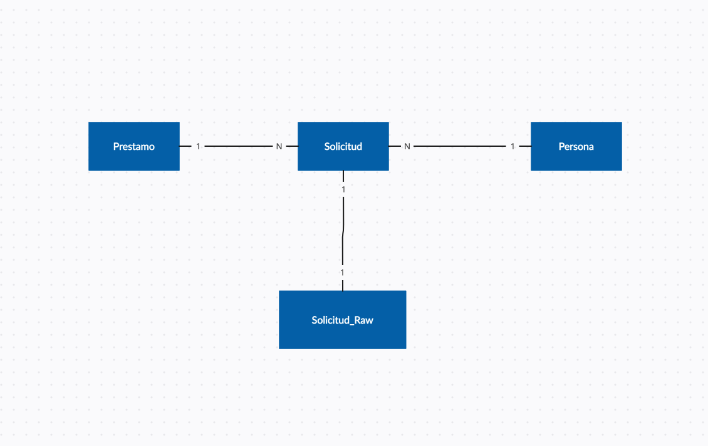

# Introduction
Esta apicación emplea django rest framework y mysql para almacenar datos de solicitudes de prestamos.
Esos datos se obtienen mediente un json enviado a un endpoint de la aplicación.
## Ejecutar aplicación


La aplicación viene configurada para poder levantarse conjuntamente con mysql utilizando Docker.
Simplemente ejecuta los siguientes comandos en la carpeta:
```
docker-compose build && docker-compose up
```
 
## Endpoints disponibles para esta aplicacion.
```
http://localhost:8000/prestamo # Recibe un json y crea una solicitud de prestamo
http://localhost:8000/solicitudes # Muestra una lista de todas las solicitudes realizadas ordenadas por la mas reciente
http://localhost:8000/raw/<int:pk> # Muestra la peticion orignal
```

## Modelos
Esquema del modelo de entidad relación empleado:


